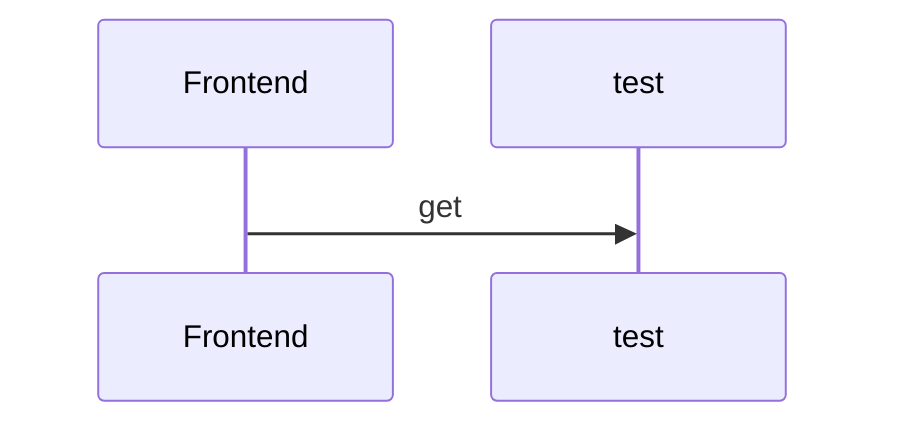

Le but du challenge est de proposer une web app ludique facilitant la recherche d'associations relevant de la [loi du 1er juillet 1901](https://www.legifrance.gouv.fr/affichTexte.do?cidTexte=LEGITEXT000006069570)
Les données sont principalement issues du répertoire national des associations
https://www.data.gouv.fr/fr/datasets/repertoire-national-des-associations/

L'app disposera dans un premier temps d'une recherche comportant des filtres (secteurs/régions... ), de différentes data viz interactive permettant d'offrir différents overviews sur différentes mailles. 

## Features +++ :

 - L'utilisateur peut partager sa géolocalisation. Afficher par la suite (sous forme de map et liste)
   les associations autour de ce dernier, sur un rayon à définir.
   proposer également plusieurs filtres.
   [https://developer.mozilla.org/fr/docs/Web/API/Geolocation_API](https://developer.mozilla.org/fr/docs/Web/API/Geolocation_API)
   
 - Automatiser le récupération du jeu de donnée

## Techno :

VueJS
NodeJS (Express)
Ant Design Vue

## Diagramme UML



## Lancer l'app

```bash
# install dependencies
$ yarn install

# serve with hot reload at localhost:3000
$ yarn dev
